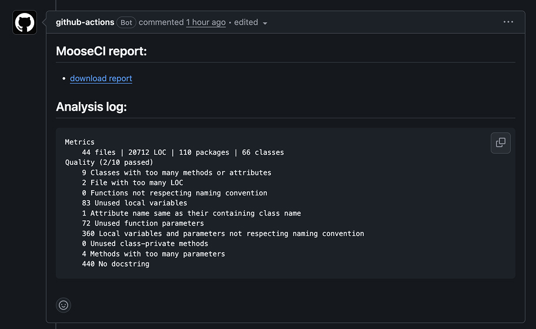

# Setup MooseCI

A GitHub Action that runs a [MooseCI](https://github.com/moosetechnology/MooseCI) analysis on your project. It writes a report and uploads it as a GitHub Actions artifact.

## Usage

```yaml
name: MooseCI
on: [push, pull_request]
permissions:
  contents: read
  actions: write
  pull-requests: write
jobs:
  analyze:
    runs-on: ubuntu-latest
    steps:
      - uses: actions/checkout@v4
      - uses: moosetechnology/setup-MooseCI@main
```

The `actions: write` permission is needed to upload the report artifact. The `pull-requests: write` permission is needed to comment the report link on pull requests.

## Example

A complete workflow example from this unofficial [tslearn pull request](https://github.com/tokyRT/tslearn/pull/2):

```yaml
name: Moose CI
on: [push, pull_request]

jobs:
  test:
    runs-on: ubuntu-latest
    permissions:
      contents: read
      actions: write
      pull-requests: write
    steps:
      - uses: actions/checkout@v4
      - uses: moosetechnology/setup-MooseCI@main
        with:
          project-path: tslearn
```

## Inputs

- `project-path`: the folder to analyze, relative to the workspace. Default: `.`
- `comment-on-pr`: comment the report artifact link on pull requests. Default: `true`

## Requirements

Your project needs a `moose-ci.ston` config file placed inside the project folder. You can create it by running the init command from inside the project folder:

```bash
cd <project-path>
docker run -v "$PWD:/src" ghcr.io/moosetechnology/moose-ci:latest init
```

The project language must be supported by MooseCI:
- Python
- Java (wip)

## How it works

The action runs MooseCI in a Docker container. It mounts your project folder inside the container at `/src`. MooseCI analyzes the current working directory and writes the report. The action then uploads the report files as an artifact named `moose-ci-report`.

## Artifact

The report files (named `report-*.json`) are uploaded as a single artifact called `moose-ci-report`. You can download it from the workflow run.

## Pull request comment

By default, the action comments on pull requests with:
- the report download URL
- the analysis summary (metrics and quality results)



You can turn this off with `comment-on-pr: false`. The comment step never fails the workflow.